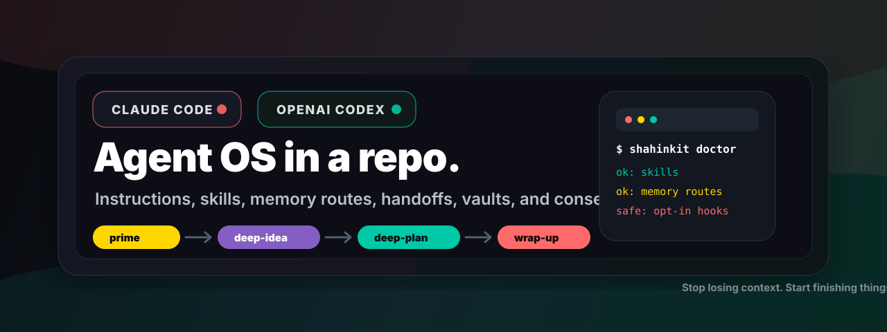

<div align="center">

# ShahinKit

**The operating system for your AI agent. Stop losing context. Start finishing things.**

<p>
  
  
  
  
  
</p>



</div>

ShahinKit is the missing layer around Claude Code and OpenAI Codex: repo instructions, skills, memory routes, handoff files, Obsidian vault templates, and consent-gated indexing in one copyable kit. It gives your agent a home, a start-up ritual, a planning spine, and a clean way to hand work back before context disappears. No hosted account, no mystery daemon, no "just paste this mega-prompt and hope". Clone it, render the adapter, inspect the files, and your agent starts acting like it has been here before.

> 🧠 Claude or Codex starts cold every session.
> 📁 Context lives in your head, not the repo.
> 🔁 Every project re-invents the same workflows.
> ShahinKit fixes all three.

## 🎬 Demo

<!-- Owner TODO: record a 30-second asciinema or Terminalizer demo showing scripts/doctor.sh, prime, and deep-idea, then add it as docs/demo.gif. -->

## 🗺️ Repo Map

```text
📦 shahinkit/ — plug-and-play workflow kit root
├── 🧰 bin/ — `shahinkit` launcher for doctor, render, install, layout, and skill paths
├── 🤖 clients/ — thin adapters for each agent surface
│   ├── 🟣 claude-cli/ — Claude Code instructions, commands, settings patch, and hook notes
│   │   ├── 🧾 commands/ — start and wrap-up command templates
│   │   └── 🪝 hooks/ — opt-in Claude Code hook mapping notes
│   ├── 🟢 codex-app/ — Codex `AGENTS.md`, config patch, hooks JSON, and skill install notes
│   │   └── 🧩 skills/ — Codex skill-copy guidance
│   └── 🖥️ claude-code-desktop/ — desktop/MCP adapter notes without pretending hook parity exists
├── 📚 docs/ — PRD, build context, memory context, codebase map, and planning artifacts
│   ├── 🔎 research/ — discovery briefs and research notes
│   └── 🧠 superpowers/ — plan artifacts for larger implementation work
│       └── 📋 plans/ — reviewed execution plans
├── 🧪 scripts/ — `doctor.sh`, `render-client-config.sh`, and deny-by-default `install.sh`
├── 🧬 shared/ — client-neutral source of truth
│   ├── 📌 handoff/ — `NEXT.md`, `HANDOFF.md`, `PARKED.md`, logs, and build state templates
│   ├── 🪝 hooks/ — optional session, memory-gate, precompact, export, and state-write scripts
│   ├── 📜 instructions/ — core contract, safety, memory routing, and handoff rules
│   ├── 🧠 memory/ — Basic Memory, Claude Memory, and route templates
│   ├── 🔒 privacy/ — private-data exclusions and public export checks
│   ├── 🧲 rag-indexing/ — opt-in consent, redaction, and allowlist docs
│   └── 🛠️ skills/ — portable workflows: prime, deep-idea, deep-plan, wrap-up, and friends
│       ├── ✅ checkpoint/ — mid-session pause state
│       ├── 💡 deep-idea/ — rough idea to research, PRD, and build context
│       ├── 🧭 deep-plan/ — memory, codebase map, dependency graph, batches, review gate
│       ├── 📥 ingest-large-folder/ — inventory and route exports before touching them
│       ├── 🧺 miniwrap/ — tiny-task closeout
│       ├── ⚡ new-idea/ — public alias for deep-idea
│       ├── 🔌 prime/ — read the smallest useful context at session start
│       ├── 🛡️ rag-consent/ — explicit approval before indexing or embedding
│       ├── 🧱 skill-builder/ — turn recurring work into reusable skills
│       └── 📦 wrap-up/ — durable end-of-session handoff and memory writeback
└── 🧰 templates/ — starter structures you copy only when you mean it
    ├── 🏗️ dev-vault/ — Obsidian-style development vault with context, specs, prompts, and archive
    │   ├── 📏 00 - Rules/ — project rules index
    │   ├── 🚶 01 - Walkthroughs/ — repeatable process notes
    │   ├── 💬 02 - Prompts/ — reusable prompt patterns
    │   ├── 📐 03 - Specs/ — specs and PRD home
    │   ├── 🧯 04 - Errors/ — failure notes and debugging records
    │   ├── 🪵 05 - Dev Log/ — session history area
    │   ├── 🧭 06 - Context/ — current project context
    │   ├── 🧰 07 - Templates/ — local template stash
    │   ├── 🗄️ Archive/ — parked old material
    │   └── 🧠 Working-Context/ — current state for agent resume
    ├── 🧑‍🎓 school-university-vault/ — subjects, assignments, readings, sources, and imports
    │   ├── 🗄️ Archive/ — old school material
    │   ├── 📝 Assignments/ — assignment packet templates and handoff files
    │   ├── 📅 Current-Term/ — active term dashboard
    │   ├── 📦 OneDrive-Imports/ — landing zone for reviewed exports
    │   ├── 📚 Subjects/ — subject folders you rename to real classes
    │   └── 🧠 Working-Context/ — current school state
    └── 🧷 repo-adapter/ — drop-in `AGENTS.md`, `CLAUDE.md`, handoff, and map templates
        └── 📚 docs/ — repo-local memory and codebase map placeholders
```

## 🧠 Workflows


| Workflow | What It Does | When To Use |
|---|---|---|
| `prime` | Reads the smallest useful context: instructions, `NEXT.md`, `HANDOFF.md`, build state, memory context, and vault index. | Start any serious session without making the agent rummage through the whole repo. |
| `deep-idea` | Turns a fuzzy idea into an idea brief, interview notes, research brief, PRD, and build context. | Before code exists, or when the idea is still mostly vibes and scattered notes. |
| `deep-plan` | Forces memory retrieval, real file mapping, dependency graph, parallel batches, validation gates, and a review stop. | Before non-trivial feature work, refactors, or anything that could become a serial todo swamp. |
| `skill-builder` | Builds a portable skill from a rough description, voice transcript, or recurring life/work problem. | When you keep asking the agent to do the same domain-specific thing. |
| `wrap-up` | Updates handoff files, next actions, session logs, build state, memory notes, and commits when the host rules require it. | End a session with enough state for the next agent to continue without archaeology. |
| `ingest-large-folder` | Inventories exports, detects sensitive categories, proposes routes, and asks before moving, extracting, indexing, or renaming. | You have a OneDrive dump, zip, course folder, or project archive and want order without chaos. |
| `rag-consent` | Shows exact files, exclusions, destination corpus, local/remote behavior, revoke steps, and approval record before indexing. | Any time embeddings, RAG, sync, or corpus rebuilds touch private files. |

`new-idea` ships as the short public alias for `deep-idea`.

## ⚡ Quick Start

1. Run the doctor.

```bash
scripts/doctor.sh
```

2. Render a reviewable adapter package.

Codex:

```bash
scripts/render-client-config.sh --client codex-app --output ./dist/codex-app
```

Claude Code:

```bash
scripts/render-client-config.sh --client claude-cli --output ./dist/claude-cli
```

3. Dry-run the install before anything gets copied.

Codex:

```bash
scripts/install.sh --client codex-app --target ./dist/codex-app-install --dry-run
```

Claude Code:

```bash
scripts/install.sh --client claude-cli --target ./dist/claude-cli-install --dry-run
```

Inspect the render. Then copy what you actually want. That restraint is the point.

## ⛔ Safety Model

> ⛔ ShahinKit is deny-by-default. It asks before deleting, moving, force-pushing, or exporting. It will never embed or index your files until you've approved the exact file list. Templates are inert until copied. Hooks are opt-in.

That is not marketing copy. It is baked into `shared/instructions/safety.md`, `rag-consent`, `ingest-large-folder`, the hook docs, and the installer defaults.

## 👋 Who It's For

- 🧑‍💻 Developers tired of cold-starting sessions.
- 🎓 Students using Obsidian + AI for classes, assignments, readings, and feedback.
- 📂 Power users ingesting large exports without letting an agent freestyle over private files.
- 🔁 Anyone who needs `NEXT.md` / `HANDOFF.md` to make AI work resumable.

## 🧱 Why It Works

Most agent setups fail because the important stuff lives outside the repo: the current state, the next task, the memory rules, the safety policy, the install shape, the "please do not nuke my files" part. ShahinKit moves that operating system into files the agent can read.

The result is boring in the best way: every session starts from `prime`, bigger ideas go through `deep-idea`, real repo work goes through `deep-plan`, messy imports hit `ingest-large-folder`, indexing hits `rag-consent`, and finished work lands in `wrap-up`. Less ritual in your head. More useful state in the project.

## 🛣️ Roadmap

- [ ] `shahinkit init` wizard that renders client, vault, and repo-adapter packages into one review folder.
- [ ] Local RAG recipe with consent records, revoke steps, and rebuild scripts.
- [ ] Claude Desktop `.mcpb` adapter once the extension surface is verified.
- [ ] Template gallery for dev, school/university, and client workflows.
- [ ] Static release check for placeholders, private-data leaks, broken links, and shell syntax.

<div align="center">
Built with ❤️ by <a href="https://facilitated.com.au">Ammar Shahin</a> · Founder of <a href="https://facilitated.com.au">Facilitated</a><br>
<sub>Less Bullshit. More Impact.</sub>
</div>
