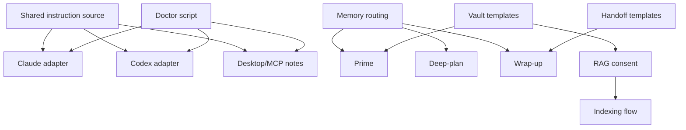

# Build Context

## Stack Decision

Start as a template-first repository with shell scripts and markdown skills. Do not scaffold an app yet.

Default implementation materials:

- Markdown for instructions, skills, PRDs, handoffs, and vault templates.
- Shell for portable hooks, doctor checks, and installer/render scripts.
- TOML snippets for Codex configuration.
- JSON snippets for Claude Code settings and hook configuration.
- Optional Python later for structured import/index workflows if shell becomes too brittle.

## Repository Structure

```text
shahinkit/
  docs/
    PRD.md
    MEMORY_CONTEXT.md
    BUILD_CONTEXT.md
    research/
      RESEARCH_BRIEF.md
  shared/
    instructions/
      core.md
      safety.md
      memory-protocol.md
      handoff-protocol.md
    skills/
      new-idea/
      deep-plan/
      prime/
      wrap-up/
      miniwrap/
      checkpoint/
      ingest-large-folder/
      rag-consent/
    hooks/
      session-start.sh
      memory-gate.sh
      precompact-snapshot.sh
      post-session-export.sh
      auto-state-write.sh
    handoff/
      NEXT.md
      HANDOFF.md
      PARKED.md
      SESSION_LOG.md
      BUILD_STATE.md
    memory/
      memory-routing.md
      basic-memory.config.template.json
      claude-mem.config.template.md
    rag-indexing/
      README.md
      OPT_IN_CONSENT.md
      REDACTION_CHECKLIST.md
      PUBLIC_EXPORT_ALLOWLIST.md
    privacy/
      PRIVATE_DATA_EXCLUSIONS.md
      PUBLIC_EXPORT_CHECKLIST.md
  clients/
    claude-cli/
      CLAUDE.md.template
      settings.patch.example.json
      commands/
      hooks/
    codex-app/
      AGENTS.md.template
      config.patch.example.toml
      hooks.json.example
      skills/
    claude-code-desktop/
      README.md
      desktop-extension-notes.md
  templates/
    dev-vault/
    school-university-vault/
    repo-adapter/
  scripts/
    doctor.sh
    render-client-config.sh
    install.sh
  bin/
    shahinkit
```

## Tooling

- `scripts/doctor.sh`: verify required commands, repository layout, and optional Claude/Codex/memory tools.
- `scripts/render-client-config.sh`: render shared source files into client-specific templates and config snippets.
- `scripts/install.sh`: explicit opt-in installer that previews changes and never overwrites user config without confirmation.
- `bin/shahinkit`: launcher for `doctor`, `render`, `install`, `show-layout`, and skill path helpers for `new-idea`, `deep-plan`, and `wrap-up`.

## Agent Configuration

### Shared Source

`shared/` is the canonical source. Client folders are adapters only.

### Claude Code

Render or document:

- `CLAUDE.md` or `.claude/CLAUDE.md`;
- `.claude/skills/<skill>/SKILL.md`;
- `.claude/settings.json` snippets;
- optional `.claude/commands/` compatibility files;
- optional `.claude/hooks/` scripts.

### Codex

Render or document:

- `AGENTS.md`;
- `.codex/config.toml` snippets;
- `.codex/hooks.json`;
- `skills/<skill>/SKILL.md` or plugin-packaged skills;
- `$skill-name` invocation as the default public path.

### Claude Desktop

Treat as a desktop extension and MCP integration surface first. Do not promise full Claude Code hook/skill parity until verified.

## Open-Source Integration Decisions

Not decided yet.

Required research lanes before post-MVP automation:

- local RAG/indexing stack;
- Obsidian-compatible indexing tools;
- portable embedding store;
- Basic Memory install/config story;
- Claude Memory install/config story;
- safe zip/OneDrive ingestion helpers;
- installer framework versus shell-only scripts.

## Scaffolding Assumptions

- The first implementation should create templates and adapters, not a hosted product.
- Every template must use placeholders instead of personal paths.
- Every indexing/import/export flow must show a preview and require explicit consent.
- Dev and school/university templates should be separate from the first commit that introduces them, so each can be reviewed independently.
- Skills should be copied from Ammar's current workflow only after private content is removed and client-specific behavior is split into adapters.

## Dependency Graph Notes



Initial implementation should run in parallel by module once the plan is approved:

- adapter templates;
- core skills;
- handoff templates;
- vault templates;
- memory/RAG consent docs;
- doctor/render scripts.

## Open Architectural Decisions

- Final RAG/indexing stack.
- Whether `new-idea` replaces `deep-idea` publicly while keeping `deep-idea` as an alias.
- Whether `deep-plan` remains one skill or splits into `memory-retrieval`, `codebase-map`, `plan-review`, and `execution-router`.
- Whether installers mutate live client config or only generate patch files by default.
- Whether Claude Desktop support ships as documentation first or a `.mcpb` desktop extension later.
- Whether school/university templates should be named `school-university`, `learning`, or separate `school` and `university` folders.
