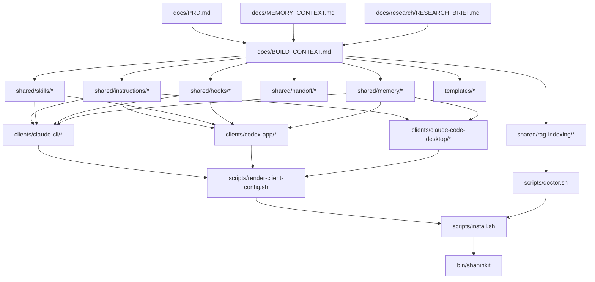

# Codebase Map

## Existing Files

- `docs/PRD.md`
  - Product requirements for ShahinKit.
  - Drives all implementation scope.
- `docs/MEMORY_CONTEXT.md`
  - Prior decisions, reusable workflow patterns, constraints, and Phase M refresh.
  - Must be read before editing skill, memory, handoff, or adapter templates.
- `docs/BUILD_CONTEXT.md`
  - Proposed repository shape, stack decision, tooling, agent configuration, dependency notes, and open architecture decisions.
  - Source for implementation file paths.
- `docs/research/RESEARCH_BRIEF.md`
  - Discovery synthesis and official docs compatibility findings.
  - Source for client support decisions and privacy constraints.

## Files To Be Touched

### Modify

- `docs/PRD.md`
  - Update only if implementation discoveries change MVP scope or constraints.
- `docs/BUILD_CONTEXT.md`
  - Update only if actual shipped layout diverges from planned layout.

### Create

- `README.md`
- `shared/instructions/core.md`
- `shared/instructions/safety.md`
- `shared/instructions/memory-protocol.md`
- `shared/instructions/handoff-protocol.md`
- `shared/skills/deep-idea/SKILL.md`
- `shared/skills/new-idea/SKILL.md`
- `shared/skills/deep-plan/SKILL.md`
- `shared/skills/skill-builder/SKILL.md`
- `shared/skills/prime/SKILL.md`
- `shared/skills/wrap-up/SKILL.md`
- `shared/skills/miniwrap/SKILL.md`
- `shared/skills/checkpoint/SKILL.md`
- `shared/skills/ingest-large-folder/SKILL.md`
- `shared/skills/rag-consent/SKILL.md`
- `shared/hooks/session-start.sh`
- `shared/hooks/memory-gate.sh`
- `shared/hooks/precompact-snapshot.sh`
- `shared/hooks/post-session-export.sh`
- `shared/hooks/auto-state-write.sh`
- `shared/handoff/NEXT.md`
- `shared/handoff/HANDOFF.md`
- `shared/handoff/PARKED.md`
- `shared/handoff/SESSION_LOG.md`
- `shared/handoff/BUILD_STATE.md`
- `shared/memory/memory-routing.md`
- `shared/memory/basic-memory.config.template.json`
- `shared/memory/claude-mem.config.template.md`
- `shared/rag-indexing/README.md`
- `shared/rag-indexing/OPT_IN_CONSENT.md`
- `shared/rag-indexing/REDACTION_CHECKLIST.md`
- `shared/rag-indexing/PUBLIC_EXPORT_ALLOWLIST.md`
- `shared/privacy/PRIVATE_DATA_EXCLUSIONS.md`
- `shared/privacy/PUBLIC_EXPORT_CHECKLIST.md`
- `clients/claude-cli/CLAUDE.md.template`
- `clients/claude-cli/settings.patch.example.json`
- `clients/claude-cli/commands/new-session.md`
- `clients/claude-cli/commands/wrap-up.md`
- `clients/claude-cli/hooks/README.md`
- `clients/codex-app/AGENTS.md.template`
- `clients/codex-app/config.patch.example.toml`
- `clients/codex-app/hooks.json.example`
- `clients/codex-app/skills/README.md`
- `clients/claude-code-desktop/README.md`
- `clients/claude-code-desktop/desktop-extension-notes.md`
- `templates/dev-vault/VAULT-INDEX.md`
- `templates/dev-vault/Working-Context/project-state.md`
- `templates/dev-vault/HANDOFF.md`
- `templates/dev-vault/NEXT.md`
- `templates/dev-vault/00 - Rules/index.md`
- `templates/dev-vault/01 - Walkthroughs/index.md`
- `templates/dev-vault/02 - Prompts/index.md`
- `templates/dev-vault/03 - Specs/index.md`
- `templates/dev-vault/04 - Errors/index.md`
- `templates/dev-vault/05 - Dev Log/sessions/.gitkeep`
- `templates/dev-vault/06 - Context/index.md`
- `templates/dev-vault/07 - Templates/index.md`
- `templates/dev-vault/Archive/.gitkeep`
- `templates/school-university-vault/VAULT-INDEX.md`
- `templates/school-university-vault/Working-Context/school-state.md`
- `templates/school-university-vault/Current-Term/index.md`
- `templates/school-university-vault/Subjects/README.md`
- `templates/school-university-vault/Subjects/Subject 1/index.md`
- `templates/school-university-vault/Subjects/Subject 1/Lessons/index.md`
- `templates/school-university-vault/Subjects/Subject 1/Readings/index.md`
- `templates/school-university-vault/Subjects/Subject 1/Notes/index.md`
- `templates/school-university-vault/Subjects/Subject 1/Sources/index.md`
- `templates/school-university-vault/Subjects/Subject 1/Assessment/index.md`
- `templates/school-university-vault/Subjects/Subject 2/index.md`
- `templates/school-university-vault/Subjects/Subject 2/Lessons/index.md`
- `templates/school-university-vault/Subjects/Subject 2/Readings/index.md`
- `templates/school-university-vault/Subjects/Subject 2/Notes/index.md`
- `templates/school-university-vault/Subjects/Subject 2/Sources/index.md`
- `templates/school-university-vault/Subjects/Subject 2/Assessment/index.md`
- `templates/school-university-vault/Subjects/Subject 3/index.md`
- `templates/school-university-vault/Subjects/Subject 3/Lessons/index.md`
- `templates/school-university-vault/Subjects/Subject 3/Readings/index.md`
- `templates/school-university-vault/Subjects/Subject 3/Notes/index.md`
- `templates/school-university-vault/Subjects/Subject 3/Sources/index.md`
- `templates/school-university-vault/Subjects/Subject 3/Assessment/index.md`
- `templates/school-university-vault/Subjects/Subject 4/index.md`
- `templates/school-university-vault/Subjects/Subject 4/Lessons/index.md`
- `templates/school-university-vault/Subjects/Subject 4/Readings/index.md`
- `templates/school-university-vault/Subjects/Subject 4/Notes/index.md`
- `templates/school-university-vault/Subjects/Subject 4/Sources/index.md`
- `templates/school-university-vault/Subjects/Subject 4/Assessment/index.md`
- `templates/school-university-vault/Subjects/Subject 5/index.md`
- `templates/school-university-vault/Subjects/Subject 5/Lessons/index.md`
- `templates/school-university-vault/Subjects/Subject 5/Readings/index.md`
- `templates/school-university-vault/Subjects/Subject 5/Notes/index.md`
- `templates/school-university-vault/Subjects/Subject 5/Sources/index.md`
- `templates/school-university-vault/Subjects/Subject 5/Assessment/index.md`
- `templates/school-university-vault/Assignments/ASSIGNMENT_TEMPLATE/_INDEX.md`
- `templates/school-university-vault/Assignments/ASSIGNMENT_TEMPLATE/brief.md`
- `templates/school-university-vault/Assignments/ASSIGNMENT_TEMPLATE/rubric.md`
- `templates/school-university-vault/Assignments/ASSIGNMENT_TEMPLATE/sources.md`
- `templates/school-university-vault/Assignments/ASSIGNMENT_TEMPLATE/drafts/.gitkeep`
- `templates/school-university-vault/Assignments/ASSIGNMENT_TEMPLATE/feedback.md`
- `templates/school-university-vault/Assignments/ASSIGNMENT_TEMPLATE/handoff.md`
- `templates/school-university-vault/OneDrive-Imports/README.md`
- `templates/school-university-vault/Archive/.gitkeep`
- `templates/repo-adapter/AGENTS.md`
- `templates/repo-adapter/CLAUDE.md`
- `templates/repo-adapter/HANDOFF.md`
- `templates/repo-adapter/NEXT.md`
- `templates/repo-adapter/BUILD_STATE.md`
- `templates/repo-adapter/SESSION_LOG.md`
- `templates/repo-adapter/docs/MEMORY_CONTEXT.md`
- `templates/repo-adapter/docs/CODEBASE_MAP.md`
- `scripts/doctor.sh`
- `scripts/render-client-config.sh`
- `scripts/install.sh`
- `bin/shahinkit`

## Dependency Chain

## Shared State / Side Effects

- Template files are inert until copied or installed.
- Hook scripts must default to dry-run-safe behavior and never mutate user files without explicit opt-in.
- Installer scripts must preview changes before writing to client config locations.
- RAG/indexing templates must require consent before embedding or scanning vault contents.
- Memory config templates must use placeholders and must not contain private project names, paths, identities, or secrets.
- Client adapters must not duplicate workflow logic; they should reference or render from `shared/`.

## Test Files

- No automated test suite exists yet.
- Verification for the first implementation should be shell/static checks:
  - `bash -n scripts/*.sh shared/hooks/*.sh bin/shahinkit`
  - `find . -type f -not -path './.git/*' -print`
  - `rg '<PRIVATE_HOME>|<PRIVATE_NAME>|<PRIVATE_EMAIL>|ANTHROPIC_API_KEY|OPENAI_API_KEY'`
  - `git diff --check`
