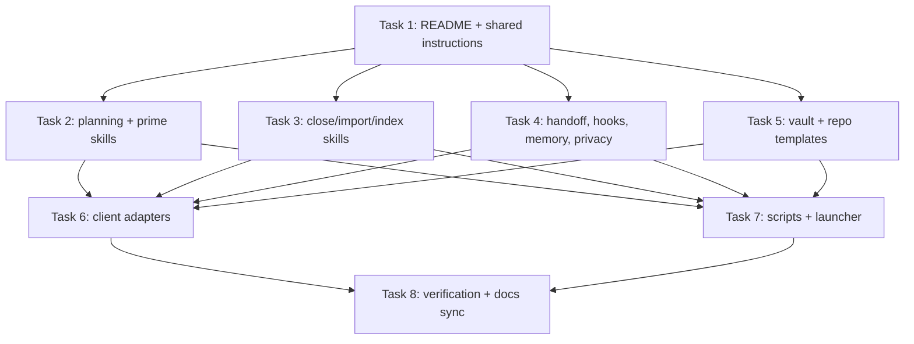

# ShahinKit Plug-And-Play Repository Implementation Plan

> **For agentic workers:** REQUIRED SUB-SKILL: Use superpowers:subagent-driven-development (recommended) or superpowers:executing-plans to implement this plan task-by-task. Steps use checkbox (`- [ ]`) syntax for tracking.

**Goal:** Build ShahinKit into a plug-and-play repo for people using Claude Code, Codex, and Claude Desktop/MCP workflows for development and school/university work.

**Architecture:** Keep `shared/` as the source of truth for instructions, skills, hooks, handoff, memory, privacy, and indexing workflows. Client folders are thin adapters for Claude Code, Codex, and Claude Desktop/MCP. Templates are inert until copied or installed, and every indexing/import/install flow requires explicit consent before touching user data or live config.

**Tech Stack:** Markdown templates and skills, shell hooks/scripts, JSON/TOML config snippets, no hosted app.

---

## Memory Context Used

- `docs/MEMORY_CONTEXT.md`: handoff/resume is the core product surface; `new-idea`, `deep-plan`, `prime`, and `wrap-up` are core modules.
- `docs/research/RESEARCH_BRIEF.md`: shared source plus thin adapters is the strongest architecture.
- `docs/BUILD_CONTEXT.md`: template-first repository, shell scripts, markdown skills, JSON/TOML snippets.
- `docs/CODEBASE_MAP.md`: complete file list, dependency chain, shared state, and verification commands.

## File Structure

Implementation creates the plug-and-play kit exactly under these top-level folders:

- `README.md`: public entrypoint with install, layout, safety model, and usage paths.
- `shared/instructions/`: client-neutral operating contract.
- `shared/skills/`: portable skills for `new-idea`, `deep-plan`, `prime`, `wrap-up`, `miniwrap`, `checkpoint`, `ingest-large-folder`, and `rag-consent`.
- `shared/hooks/`: shell hooks that are inert unless installed and explicitly enabled.
- `shared/handoff/`: handoff file templates.
- `shared/memory/`: Basic Memory and Claude Memory routing/config templates.
- `shared/rag-indexing/`: opt-in indexing and redaction templates.
- `shared/privacy/`: private-data and public-export checklists.
- `clients/claude-cli/`: Claude Code templates and snippets.
- `clients/codex-app/`: Codex App templates and snippets.
- `clients/claude-code-desktop/`: Claude Desktop/MCP guidance.
- `templates/dev-vault/`: development Obsidian vault template.
- `templates/school-university-vault/`: school/university vault template.
- `templates/repo-adapter/`: project repo adapter files.
- `scripts/`: `doctor`, render, and install scripts.
- `bin/shahinkit`: launcher.

## Dependency Graph



## Parallel-Batch Schedule

### Batch 1: INLINE

Task 1 is the root dependency. Execute it inline.

### Batch 2: LAUNCH SWARM

Tasks 2, 3, 4, and 5 write disjoint directories and all depend only on Task 1.

```bash
mkdir -p .exec/briefs .exec/logs
codex exec -C "$PWD" -a never -s workspace-write -o .exec/logs/task-02.log "$(cat .exec/briefs/task-02-planning-prime-skills.md)" &
codex exec -C "$PWD" -a never -s workspace-write -o .exec/logs/task-03-close-import-index-skills.log "$(cat .exec/briefs/task-03-close-import-index-skills.md)" &
codex exec -C "$PWD" -a never -s workspace-write -o .exec/logs/task-04-handoff-hooks-memory-privacy.log "$(cat .exec/briefs/task-04-handoff-hooks-memory-privacy.md)" &
codex exec -C "$PWD" -a never -s workspace-write -o .exec/logs/task-05-vault-repo-templates.log "$(cat .exec/briefs/task-05-vault-repo-templates.md)" &
wait
```

### Batch 3: LAUNCH SWARM

Tasks 6 and 7 write disjoint directories after the shared and template surfaces exist.

```bash
mkdir -p .exec/briefs .exec/logs
codex exec -C "$PWD" -a never -s workspace-write -o .exec/logs/task-06-client-adapters.log "$(cat .exec/briefs/task-06-client-adapters.md)" &
codex exec -C "$PWD" -a never -s workspace-write -o .exec/logs/task-07-scripts-launcher.log "$(cat .exec/briefs/task-07-scripts-launcher.md)" &
wait
```

### Batch 4: INLINE

Task 8 verifies the whole repository and updates docs only if actual shipped layout differs from the map.

## Task 1: README And Shared Instructions

**Files:**

- Create: `README.md`
- Create: `shared/instructions/core.md`
- Create: `shared/instructions/safety.md`
- Create: `shared/instructions/memory-protocol.md`
- Create: `shared/instructions/handoff-protocol.md`

- [ ] **Step 1: Check clean worktree**

Run:

```bash
git status --short --branch
```

Expected: branch line only.

- [ ] **Step 2: Create `README.md`**

Content requirements:

- H1: `ShahinKit`
- One-sentence product definition: plug-and-play Claude Code/Codex workflow kit.
- Sections:
  - `What This Is`
  - `Who It Is For`
  - `Repository Layout`
  - `Install Model`
  - `Core Workflows`
  - `Safety Model`
  - `Quick Start`
- Include the commands:

```bash
scripts/doctor.sh
scripts/render-client-config.sh --client codex-app --output ./dist/codex-app
scripts/render-client-config.sh --client claude-cli --output ./dist/claude-cli
```

- State that install scripts preview changes and require consent before modifying live config.

- [ ] **Step 3: Create `shared/instructions/core.md`**

Content requirements:

- Purpose: shared behavior for all client adapters.
- Include rules:
  - read before write;
  - edit minimally;
  - ask before destructive operations;
  - keep client-specific behavior in adapters;
  - keep shared workflow logic in `shared/`.
- Include the workflow order:
  - `prime`;
  - `new-idea` for greenfield;
  - `deep-plan` for mature repo work;
  - implementation;
  - `wrap-up`.

- [ ] **Step 4: Create `shared/instructions/safety.md`**

Content requirements:

- Cover destructive operations, secrets, personal data, school data, transcripts, and public export.
- Include deny-by-default indexing/export policy.
- State that hook scripts must be opt-in.

- [ ] **Step 5: Create `shared/instructions/memory-protocol.md`**

Content requirements:

- Define separate memory projects for dev, school/university, and client work.
- Include Basic Memory and Claude Memory as optional integrations.
- State that memory retrieval happens before architecture or planning claims.
- State that indexing or embedding requires `rag-consent`.

- [ ] **Step 6: Create `shared/instructions/handoff-protocol.md`**

Content requirements:

- Define `NEXT.md`, `HANDOFF.md`, `PARKED.md`, `SESSION_LOG.md`, and `BUILD_STATE.md`.
- Include start-of-session read order.
- Include end-of-session write order.
- Include per-track handoff naming: `handoffs/YYYY-MM-DDTHH-MM-SSZ-<track>-<slug>.md`.

- [ ] **Step 7: Commit**

```bash
git add README.md shared/instructions
git commit -m "docs(core): add shared kit instructions"
```

## Task 2: Planning And Prime Skills

**Files:**

- Create: `shared/skills/new-idea/SKILL.md`
- Create: `shared/skills/deep-plan/SKILL.md`
- Create: `shared/skills/prime/SKILL.md`

- [ ] **Step 1: Read source docs**

Run:

```bash
sed -n '1,220p' docs/MEMORY_CONTEXT.md
sed -n '1,260p' docs/BUILD_CONTEXT.md
sed -n '1,220p' shared/instructions/core.md
```

- [ ] **Step 2: Create `shared/skills/new-idea/SKILL.md`**

Content requirements:

- Frontmatter:

```yaml
---
name: new-idea
description: Turn a rough product or project idea into research notes, PRD, build context, and a deep-plan-ready repo package.
---
```

- Workflow:
  - capture idea;
  - write `docs/research/IDEA_BRIEF.md`;
  - ask concise interview questions only for unknowns research cannot answer;
  - write `docs/research/INTERVIEW.md`;
  - run research lanes;
  - write `docs/research/RESEARCH_BRIEF.md`;
  - write `docs/PRD.md`;
  - write `docs/BUILD_CONTEXT.md`;
  - stop for review before implementation planning.
- Include explicit rule: do not write implementation source files inside `new-idea`.

- [ ] **Step 3: Create `shared/skills/deep-plan/SKILL.md`**

Content requirements:

- Frontmatter:

```yaml
---
name: deep-plan
description: Plan non-trivial feature work through memory retrieval, codebase mapping, dependency graph, parallel batches, and review gate before code.
---
```

- Workflow:
  - Phase M: memory retrieval into `docs/MEMORY_CONTEXT.md`;
  - Phase 0: codebase mapping into `docs/CODEBASE_MAP.md`;
  - Phase 1: write plan to `docs/superpowers/plans/YYYY-MM-DD-<slug>.md`;
  - validation checklist;
  - approval gate;
  - execution route.
- Include validation checklist from `docs/BUILD_CONTEXT.md`: dependency graph, parallel batch schedule, LAUNCH SWARM/INLINE decisions, no duration claims, no unhandled blockers.

- [ ] **Step 4: Create `shared/skills/prime/SKILL.md`**

Content requirements:

- Frontmatter:

```yaml
---
name: prime
description: Read the smallest useful project context at session start without editing files.
---
```

- Read order:
  - local project instruction file;
  - `NEXT.md`;
  - `HANDOFF.md`;
  - `BUILD_STATE.md`;
  - `docs/MEMORY_CONTEXT.md`;
  - `VAULT-INDEX.md` when present.
- State that `prime` is read-only.

- [ ] **Step 5: Commit**

```bash
git add shared/skills/new-idea shared/skills/deep-plan shared/skills/prime
git commit -m "feat(skills): add planning and prime workflows"
```

## Task 3: Close, Import, And Index Skills

**Files:**

- Create: `shared/skills/wrap-up/SKILL.md`
- Create: `shared/skills/miniwrap/SKILL.md`
- Create: `shared/skills/checkpoint/SKILL.md`
- Create: `shared/skills/ingest-large-folder/SKILL.md`
- Create: `shared/skills/rag-consent/SKILL.md`

- [ ] **Step 1: Create `wrap-up`**

Content requirements:

- Frontmatter name: `wrap-up`.
- Phases:
  - inspect state;
  - summarize shipped work;
  - write/update `NEXT.md`;
  - write/update `HANDOFF.md`;
  - append `SESSION_LOG.md`;
  - update `BUILD_STATE.md` where present;
  - write memory notes only when configured;
  - run verification commands selected by project type;
  - commit changes when the host project requires it.
- Include adapter knobs:
  - local-only;
  - Git;
  - Basic Memory;
  - Claude Memory;
  - Obsidian.

- [ ] **Step 2: Create `miniwrap`**

Content requirements:

- Frontmatter name: `miniwrap`.
- Scope: tiny tasks, one-off edits, quick checks.
- Output:
  - brief result;
  - next action only if needed;
  - commit if files changed and repo rules require it.
- Escalate to `wrap-up` when more than one workstream or open decision remains.

- [ ] **Step 3: Create `checkpoint`**

Content requirements:

- Frontmatter name: `checkpoint`.
- Purpose: mid-session handoff without claiming final completion.
- Writes:
  - current state;
  - exact next command;
  - open blockers;
  - files touched;
  - verification status.

- [ ] **Step 4: Create `ingest-large-folder`**

Content requirements:

- Frontmatter name: `ingest-large-folder`.
- Supports OneDrive exports, zip files, course folders, and project archives.
- Requires:
  - inventory first;
  - ask before moving, deleting, extracting, embedding, or indexing;
  - create `_INDEX.md` with source metadata;
  - route into dev vault or school/university vault.

- [ ] **Step 5: Create `rag-consent`**

Content requirements:

- Frontmatter name: `rag-consent`.
- Requires:
  - show exact folders/files proposed for indexing;
  - show private-data exclusions;
  - ask for explicit approval;
  - write consent record;
  - allow revoke/rebuild instructions.

- [ ] **Step 6: Commit**

```bash
git add shared/skills/wrap-up shared/skills/miniwrap shared/skills/checkpoint shared/skills/ingest-large-folder shared/skills/rag-consent
git commit -m "feat(skills): add lifecycle and ingestion workflows"
```

## Task 4: Handoff, Hooks, Memory, RAG, And Privacy

**Files:**

- Create: `shared/hooks/session-start.sh`
- Create: `shared/hooks/memory-gate.sh`
- Create: `shared/hooks/precompact-snapshot.sh`
- Create: `shared/hooks/post-session-export.sh`
- Create: `shared/hooks/auto-state-write.sh`
- Create: `shared/handoff/NEXT.md`
- Create: `shared/handoff/HANDOFF.md`
- Create: `shared/handoff/PARKED.md`
- Create: `shared/handoff/SESSION_LOG.md`
- Create: `shared/handoff/BUILD_STATE.md`
- Create: `shared/memory/memory-routing.md`
- Create: `shared/memory/basic-memory.config.template.json`
- Create: `shared/memory/claude-mem.config.template.md`
- Create: `shared/rag-indexing/README.md`
- Create: `shared/rag-indexing/OPT_IN_CONSENT.md`
- Create: `shared/rag-indexing/REDACTION_CHECKLIST.md`
- Create: `shared/rag-indexing/PUBLIC_EXPORT_ALLOWLIST.md`
- Create: `shared/privacy/PRIVATE_DATA_EXCLUSIONS.md`
- Create: `shared/privacy/PUBLIC_EXPORT_CHECKLIST.md`

- [ ] **Step 1: Create hook scripts**

Each script must start with:

```bash
#!/usr/bin/env bash
set -euo pipefail
```

Each script must accept `SHAHINKIT_HOME`, `SHAHINKIT_PROJECT_ROOT`, and `SHAHINKIT_TRACK` through environment variables. Each script must print what it would read or write before mutating files.

Script behavior:

- `session-start.sh`: print ordered context files that exist.
- `memory-gate.sh`: print memory projects and remind the agent to run retrieval before planning.
- `precompact-snapshot.sh`: write a timestamped snapshot under `.shahinkit/snapshots/` only when `SHAHINKIT_WRITE_SNAPSHOT=1`.
- `post-session-export.sh`: print transcript export guidance and do no export unless `SHAHINKIT_EXPORT_TRANSCRIPT=1`.
- `auto-state-write.sh`: append a short state line only when `SHAHINKIT_AUTO_STATE_WRITE=1`.

- [ ] **Step 2: Create handoff templates**

Each file must include clear headings and template variables in braces.

Required headings:

- `NEXT.md`: `Current Track`, `Next Action`, `Resume Command`, `Open Decisions`.
- `HANDOFF.md`: `Context`, `Changed Files`, `Verification`, `Risks`, `Exact Resume Point`.
- `PARKED.md`: table with track, status, handoff path, last updated.
- `SESSION_LOG.md`: append-only entry format.
- `BUILD_STATE.md`: what works, what is blocked, verification matrix.

- [ ] **Step 3: Create memory templates**

`memory-routing.md` must define `dev`, `school-university`, and `client` memory routes.

`basic-memory.config.template.json` must be valid JSON with template variables:

```json
{
  "projects": {
    "SHAHINKIT_DEV_MEMORY": {
      "path": "{{DEV_VAULT_PATH}}"
    },
    "SHAHINKIT_SCHOOL_MEMORY": {
      "path": "{{SCHOOL_VAULT_PATH}}"
    }
  }
}
```

`claude-mem.config.template.md` must describe corpus names, paths, and separation rules.

- [ ] **Step 4: Create RAG/privacy docs**

Include deny-by-default indexing, redaction checklist, allowlist export model, and private-data exclusions.

- [ ] **Step 5: Commit**

```bash
git add shared/hooks shared/handoff shared/memory shared/rag-indexing shared/privacy
git commit -m "feat(shared): add handoff memory and safety assets"
```

## Task 5: Vault And Repo Templates

**Files:** all paths listed under `templates/` in `docs/CODEBASE_MAP.md`.

- [ ] **Step 1: Create dev vault template**

Create the exact dev vault files from `docs/CODEBASE_MAP.md`.

`templates/dev-vault/VAULT-INDEX.md` must include:

- read order;
- folder map;
- do-not-read-by-default guidance for archive/session noise;
- agent entry points.

`Working-Context/project-state.md` must include frontmatter fields:

```yaml
---
type: working-context
project: "{{PROJECT_NAME}}"
status: active
last-updated: "{{YYYY-MM-DD}}"
---
```

- [ ] **Step 2: Create school/university vault template**

Create the exact school/university files from `docs/CODEBASE_MAP.md`.

`templates/school-university-vault/VAULT-INDEX.md` must include:

- current term;
- subjects;
- assignments;
- milestones;
- evidence;
- import holding folder;
- agent read order.

Assignment template files must include:

- brief;
- rubric;
- sources;
- drafts folder;
- feedback;
- handoff.

- [ ] **Step 3: Create repo adapter template**

Create the exact repo adapter files from `docs/CODEBASE_MAP.md`.

`templates/repo-adapter/AGENTS.md` and `templates/repo-adapter/CLAUDE.md` must point to shared concepts without hardcoded local paths.

- [ ] **Step 4: Commit**

```bash
git add templates
git commit -m "feat(templates): add dev school and repo templates"
```

## Task 6: Client Adapters

**Files:**

- Create: `clients/claude-cli/CLAUDE.md.template`
- Create: `clients/claude-cli/settings.patch.example.json`
- Create: `clients/claude-cli/commands/new-session.md`
- Create: `clients/claude-cli/commands/wrap-up.md`
- Create: `clients/claude-cli/hooks/README.md`
- Create: `clients/codex-app/AGENTS.md.template`
- Create: `clients/codex-app/config.patch.example.toml`
- Create: `clients/codex-app/hooks.json.example`
- Create: `clients/codex-app/skills/README.md`
- Create: `clients/claude-code-desktop/README.md`
- Create: `clients/claude-code-desktop/desktop-extension-notes.md`

- [ ] **Step 1: Create Claude adapter**

`CLAUDE.md.template` must:

- include start read order;
- point to `shared/instructions`;
- explain skills install path;
- explain optional commands and hooks.

`settings.patch.example.json` must include only example snippets for hooks/MCP and no private paths.

- [ ] **Step 2: Create Codex adapter**

`AGENTS.md.template` must:

- include operating contract;
- reference `$new-idea`, `$deep-plan`, `$prime`, and `$wrap-up`;
- avoid relying on custom slash aliases.

`config.patch.example.toml` must include MCP and hook examples using `{{VARIABLES}}`.

`hooks.json.example` must require the Codex hook feature flag in comments or adjacent text.

- [ ] **Step 3: Create Claude Desktop notes**

Desktop docs must:

- describe MCP/extension support;
- avoid claiming full Claude Code CLI hook parity;
- explain how to use the shared memory and vault templates from Desktop.

- [ ] **Step 4: Commit**

```bash
git add clients
git commit -m "feat(clients): add claude and codex adapters"
```

## Task 7: Scripts And Launcher

**Files:**

- Create: `scripts/doctor.sh`
- Create: `scripts/render-client-config.sh`
- Create: `scripts/install.sh`
- Create: `bin/shahinkit`

- [ ] **Step 1: Create `scripts/doctor.sh`**

Script requirements:

- `#!/usr/bin/env bash`
- `set -euo pipefail`
- Check for `git`, `bash`, `find`, `sed`, and `rg`.
- Print found/missing status.
- Check that `shared/`, `clients/`, and `templates/` exist.
- Print optional checks for `codex`, `claude`, Basic Memory, and Claude Memory.
- Do not mutate files.

- [ ] **Step 2: Create `scripts/render-client-config.sh`**

Script requirements:

- Arguments:
  - `--client claude-cli|codex-app|claude-code-desktop`;
  - `--output <path>`.
- Copy matching client adapter into output.
- Copy `shared/` into output.
- Refuse to write when output exists unless `--force` is passed.

- [ ] **Step 3: Create `scripts/install.sh`**

Script requirements:

- Arguments:
  - `--client <name>`;
  - `--target <path>`;
  - `--dry-run`;
  - `--yes`.
- Default to dry-run unless `--yes` is present.
- Print every write operation before executing it.
- Never edit live config directly; copy rendered files to target.

- [ ] **Step 4: Create `bin/shahinkit`**

Launcher requirements:

- Commands:
  - `doctor`;
  - `render`;
  - `install`;
  - `show-layout`;
  - `new-idea`;
  - `deep-plan`;
  - `wrap-up`.
- Delegate to scripts for `doctor`, `render`, and `install`.
- For skill commands, print the shared skill path and invocation guidance.

- [ ] **Step 5: Make scripts executable**

```bash
chmod +x scripts/doctor.sh scripts/render-client-config.sh scripts/install.sh bin/shahinkit
```

- [ ] **Step 6: Commit**

```bash
git add scripts bin
git commit -m "feat(cli): add doctor render install launcher"
```

## Task 8: Verification And Docs Sync

**Files:**

- Modify: `docs/BUILD_CONTEXT.md` only if shipped layout differs.
- Modify: `docs/PRD.md` only if shipped MVP differs.

- [ ] **Step 1: Run shell syntax checks**

```bash
bash -n scripts/doctor.sh scripts/render-client-config.sh scripts/install.sh bin/shahinkit shared/hooks/*.sh
```

Expected: no output and exit code 0.

- [ ] **Step 2: Run repo inventory**

```bash
find . -type f -not -path './.git/*' -print | sort
```

Expected: all paths from `docs/CODEBASE_MAP.md` exist.

- [ ] **Step 3: Run private-data scan**

```bash
rg '/Users/integrale|Ammar|Yasser|office@pff.org|ANTHROPIC_API_KEY|OPENAI_API_KEY'
```

Expected: matches only inside planning docs that intentionally record source constraints, not shipped templates under `shared/`, `clients/`, `templates/`, `scripts/`, or `bin/`.

- [ ] **Step 4: Run whitespace check**

```bash
git diff --check
```

Expected: no output and exit code 0.

- [ ] **Step 5: Run doctor**

```bash
scripts/doctor.sh
```

Expected: required tools and required directories are reported.

- [ ] **Step 6: Run render smoke tests**

```bash
rm -rf dist
scripts/render-client-config.sh --client codex-app --output dist/codex-app
scripts/render-client-config.sh --client claude-cli --output dist/claude-cli
scripts/render-client-config.sh --client claude-code-desktop --output dist/claude-code-desktop
find dist -maxdepth 3 -type f -print | sort
```

Expected: rendered client folders contain adapter files and `shared/`.

- [ ] **Step 7: Commit verification/docs updates**

If docs changed:

```bash
git add docs/PRD.md docs/BUILD_CONTEXT.md
git commit -m "docs(build): align shipped kit layout"
```

Then commit executable mode or verification support changes if present:

```bash
git status --short
git add .
git commit -m "chore(verify): validate plug-and-play kit"
```

If no files changed after verification, do not create an empty commit.

## Plan Validation

- [x] Dependency graph exists and every task appears in it.
- [x] Every task with no dependencies is in Batch 1.
- [x] No two tasks are serialized unless a strict dependency exists.
- [x] Every batch has an explicit LAUNCH SWARM or INLINE decision.
- [x] LAUNCH SWARM batches include shell dispatch commands using `&` and `wait`.
- [x] No duration claims appear in this plan.
- [x] No blocker is left unhandled; Basic Memory unavailability is recorded in `docs/MEMORY_CONTEXT.md`.
- [x] The plan is a dependency graph plus parallel-batch schedule, not a serial todo list.
